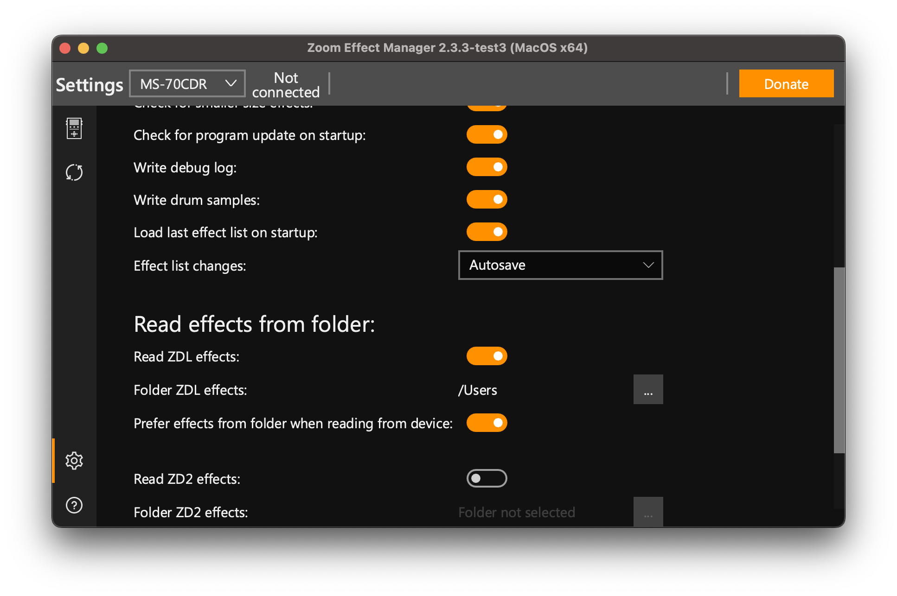
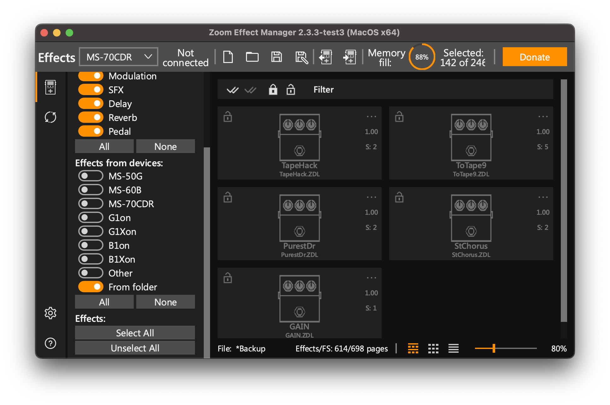

# Zoom MultiStomp ZDL Airwindows Ports

Custom `.ZDL` effects for Zoom MultiStomp pedals, plus the reverse-engineered
toolchain used to build them.

## Download Effects

The ready-to-load effects are in [dist/](dist/). Point Zoom Effect Manager at
that folder, or download individual `.ZDL` files from it. You do not need the
build toolchain unless you want to modify or rebuild effects.

## Install With Zoom Effect Manager

Use [Zoom Effect Manager](https://zoomeffectmanager.com/en/download/) 2.3.3 or
newer.

1. Open Zoom Effect Manager, connect your pedal, then open `Settings`.
2. Choose `Read Effects from folder` and select this repo's [dist/](dist/)
   folder.



3. In the effect browser, enable `Effects from devices` and `From Folder`.
4. Add the desired effects to the device and write them with Zoom Effect
   Manager.



Back up your current effect list before writing. This project is still reverse
engineering firmware behavior, and experimental builds can crash or freeze a
pedal until power-cycled.

More detailed install notes live in [docs/INSTALLING-ZDLS.md](docs/INSTALLING-ZDLS.md).

## Compatibility

Hardware testing is still narrow. Treat every model outside the confirmed row
as unverified until someone reports a clean load and audio test.

| Device family | Status |
|---|---|
| Zoom MS-70CDR firmware 2.10 | Primary hardware target; current release effects have been developed against this pedal. |
| Other ZDL-based Zoom MultiStomp pedals | Unconfirmed. They may load compatible ZDLs, but need hardware reports. |
| Newer Zoom ZD2-based pedals | Not supported by these ZDL builds. |

## Effect Status

| File | Status |
|---|---|
| [StChorus.ZDL](dist/StChorus.ZDL) | Airwindows `StereoChorus`; hardware-tested and currently the best reference port in this repo. |
| [ToTape9.ZDL](dist/ToTape9.ZDL) | Airwindows `ToTape9`; experimental state-backed port that still needs hardware validation. |
| [TapeHack.ZDL](dist/TapeHack.ZDL) | Airwindows `TapeHack`; early port, needs broader listening and hardware reports. |
| [PurestDr.ZDL](dist/PurestDr.ZDL) | Airwindows `PurestDrive`; early port, needs broader listening and hardware reports. |
| [GAIN.ZDL](dist/GAIN.ZDL) | Small utility/reference effect used to validate the build path. |

## Known Issues

- Only the Zoom MS-70CDR firmware 2.10 has been tested seriously so far.
- Experimental builds can freeze or crash the pedal until it is power-cycled.
- `ToTape9.ZDL` is not yet a confirmed 1:1 hardware release.
- Parameter scaling is part of the porting work. A port should not be called
  source-equivalent until its raw knob ranges have been confirmed on hardware.
- These are `.ZDL` builds, not `.ZD2` builds.

## Documentation

Start here if you want more than the download folder:

| Doc | What it covers |
|---|---|
| [docs/INSTALLING-ZDLS.md](docs/INSTALLING-ZDLS.md) | Step-by-step Zoom Effect Manager folder install. |
| [docs/ZDL-REVERSE-ENGINEERING-STATUS.md](docs/ZDL-REVERSE-ENGINEERING-STATUS.md) | Current map of the ZDL wrapper, runtime ABI, and known state fields. |
| [docs/STATE-ABI-PROGRESS.md](docs/STATE-ABI-PROGRESS.md) | Hardware probe log and findings we do not want to lose. |
| [docs/AIRWINDOWS-1TO1-PORT-ROADMAP.md](docs/AIRWINDOWS-1TO1-PORT-ROADMAP.md) | Roadmap for making honest source-equivalent Airwindows ports. |
| [docs/AIRWINDOWS-EXACT-PORTS.md](docs/AIRWINDOWS-EXACT-PORTS.md) | Rules for what can and cannot be called a 1:1 Airwindows port. |
| [docs/SAFE-DSP-RULES.md](docs/SAFE-DSP-RULES.md) | Pedal-safe DSP/linking constraints learned from hardware failures. |
| [docs/3-PARAM-LINKER-BUG.md](docs/3-PARAM-LINKER-BUG.md) | Investigation of the old edit-mode parameter-count bug. |
| [docs/TI-PDF-NOTES.md](docs/TI-PDF-NOTES.md) | Notes distilled from the TI C6000 manuals in this folder. |
| [docs/CONTRIBUTING.md](docs/CONTRIBUTING.md) | Hardware-test asks and contribution notes. |
| [docs/sprab89b.pdf](docs/sprab89b.pdf) | TI C6000 application note reference. |
| [docs/sprui03f.pdf](docs/sprui03f.pdf) | TI C6000 compiler/toolchain reference. |
| [docs/sprui04g.pdf](docs/sprui04g.pdf) | TI C6000 assembly/linker tools reference. |
| [build/ABI.md](build/ABI.md) | Low-level linker/runtime ABI reference for developers. |

## Build From Source

Building requires Python 3.10+ and TI C6000 Code Generation Tools. Installing
prebuilt effects from [dist/](dist/) does not.

The build scripts currently expect the TI compiler here:

```text
/Applications/ti/ccs2050/ccs/tools/compiler/ti-cgt-c6000_8.5.0.LTS
```

On Linux, Windows, or another Code Composer Studio install, update `TI_ROOT` in
the relevant `src/airwindows/*/build.py`.

Build release effects:

```bash
python3 -B build_all.py
```

Build one effect:

```bash
python3 -B build_all.py stereochorus
python3 -B build_all.py totape9
```

Build diagnostic/probe effects too:

```bash
python3 -B build_all.py --all
```

The default build intentionally keeps [dist/](dist/) clean and release-focused.
Diagnostic ZDLs are useful for development, but should not be mixed into the
download folder.

## Technical Notes

This repo builds loadable Zoom `.ZDL` effects without Zoom's unreleased SDK.
The core pieces are:

| Path | Purpose |
|---|---|
| [build/linker.py](build/linker.py) | Static linker: TI C6000 `.obj` -> complete Zoom `.ZDL`. |
| [src/airwindows/](src/airwindows/) | Effect sources, manifests, images, and per-effect build scripts. |
| [dist/](dist/) | Release `.ZDL` files for users. |
| [working_zdls/](working_zdls/) | Tracked stock ZDL corpus used for comparison. |

The important recent finding is that custom effects can use the host-managed
large state descriptor at `ctx[3]`. That is what made the stateful
`StereoChorus` port possible and is now being used for `ToTape9`.

Known runtime map for custom ZDLs:

| Field | Meaning |
|---:|---|
| `ctx[1]` | parameter float table |
| `ctx[4]` | dry/guitar input buffer |
| `ctx[5]` | current effect buffer, 8 left samples then 8 right samples |
| `ctx[6]` | output accumulator for effects that add instead of processing in place |
| `ctx[11]` / `ctx[12]` | magic shuttle; preserve every audio call |
| `ctx[2] + 0x10` / `ctx[2] + 0x18` | small persistent per-instance state blocks |
| `ctx[3][0..2]` | large per-instance descriptor: base, end, byte span |

Parameter scaling is not universal across every handler path. `StereoChorus`
showed that the current release handler path behaves like normalized `0..1`
knob floats, while older helper assumptions saturated around UI value 14.
Effects that claim source-compatible control laws should document how their raw
parameter scaling was confirmed.

## Repository Layout

```text
ZoomMultistompZDL/
├── README.md
├── build/                 linker, ELF/ZDL helpers, stock-derived handler blobs
├── docs/                  install notes, ABI status, hardware probe logs
├── dist/                  release ZDLs to load in Zoom Effect Manager
├── src/airwindows/        effect sources, manifests, and build scripts
├── working_zdls/          tracked stock ZDL corpus used for comparison
└── build_all.py           release/probe build entrypoint
```

Several research references are useful locally but are intentionally ignored by
git, so they are not part of this repo checkout:

```text
airwindows-ref/          optional full Airwindows source tree
zoom-fx-modding-ref/     optional community ZDL notes and disassembly walkthroughs
ZoomPedalFun-main/       optional independent Zoom firmware RE work
```

If you clone those beside the repo, keep treating them as read-only references.

## Contributing

Hardware reports are gold. When testing a ZDL, please include:

| Item | Example |
|---|---|
| Pedal model and firmware | `MS-70CDR firmware 2.10` |
| ZDL filename and commit | `StChorus.ZDL @ cee0d8a` |
| Load result | boots, freezes on startup, freezes on unbypass |
| Audio result | bypass, dry passthrough, chorus works, high-pitched tone |
| Parameter behavior | Speed works 0..100, Depth saturates, page 2 knob missing |

Open an issue or PR with findings. Keep experimental claims precise: "boots on
my MS-70CDR" is more useful than "works everywhere."

## License

Repository code is MIT unless a file says otherwise. Airwindows plugin DSP is
MIT by Chris Johnson/Airwindows. Zoom firmware, stock effects, and third-party
reference material are owned by their respective authors and are used only for
interoperability and reverse-engineering research.
